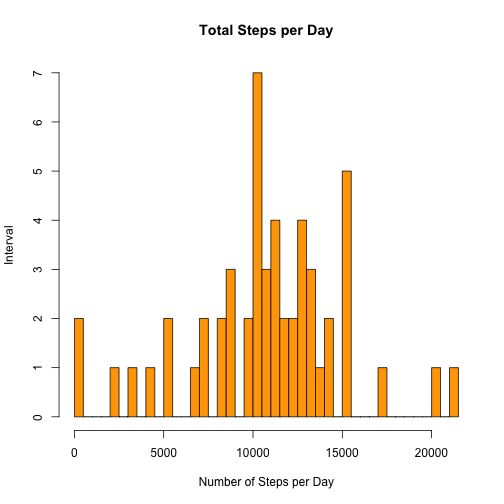
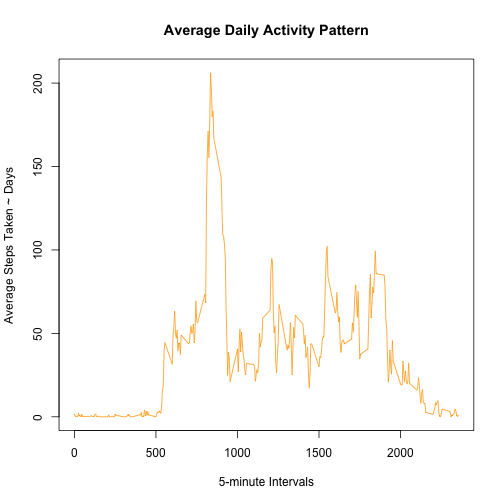
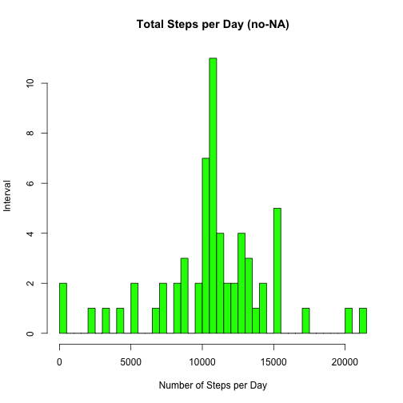
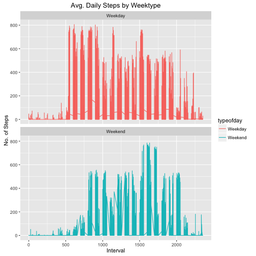

Introduction  
==================================================================
### This is my first markdown R document. Thank you for taking the time to review my work. Glad to be part of this certification, and have learned so much thus far. I hope to get this right!  


** Reproducible Research **
Peer Graded Assignment: Course Project 1  

It is now possible to collect a large amount of data about personal movement using activity monitoring devices such as a Fitbit, Nike Fuelband, or Jawbone Up. These type of devices are part of the "quantified self" movement -- a group of enthusiasts who take measurements about themselves regularly to improve their health, to find patterns in their behavior, or because they are tech geeks. But these data remain under-utilized both because the raw data are hard to obtain and there is a lack of statistical methods and software for processing and interpreting the data.

This assignment makes use of data from a personal activity monitoring device. This device collects data at 5 minute intervals through out the day. The data consists of two months of data from an anonymous individual collected during the months of October and November, 2012 and include the number of steps taken in 5 minute intervals each day.

**Data**

The data for this assignment can be downloaded from the course web site: https://d396qusza40orc.cloudfront.net/repdata%2Fdata%2Factivity.zip

Dataset: Activity monitoring data [52K]
The variables included in this dataset are:

- steps: Number of steps taking in a 5-minute interval (missing values are coded as NA)

- date: The date on which the measurement was taken in YYYY-MM-DD format

- interval: Identifier for the 5-minute interval in which measurement was taken

The dataset is stored in a comma-separated-value (CSV) file and there are a total of 17,568 observations in this dataset.

**Assignment**

This assignment will be described in multiple parts. You will need to write a report that answers the questions detailed below. Ultimately, you will need to complete the entire assignment in a single R markdown document that can be processed by knitr and be transformed into an HTML file.

Throughout your report make sure you always include the code that you used to generate the output you present. When writing code chunks in the R markdown document, always use echo = TRUE so that someone else will be able to read the code. This assignment will be evaluated via peer assessment so it is essential that your peer evaluators be able to review the code for your analysis.

For the plotting aspects of this assignment, feel free to use any plotting system in R (i.e., base, lattice, ggplot2)

Fork/clone the GitHub repository created for this assignment. You will submit this assignment by pushing your completed files into your forked repository on GitHub. The assignment submission will consist of the URL to your GitHub repository and the SHA-1 commit ID for your repository state.

NOTE: The GitHub repository also contains the dataset for the assignment so you do not have to download the data separately.

Loading and preprocessing the data

Show any code that is needed to

Load the data (i.e. read.csv())

**Required Libraries**

```r
library(knitr)
library(ggplot2)
library(dplyr)
library(plyr)
```

**Download the file and unzip**

```r
temp <- tempfile()
download.file("https://d396qusza40orc.cloudfront.net/repdata%2Fdata%2Factivity.zip", temp, mode="wb")
unzip(temp, "activity.csv")
activity <- read.csv("activity.csv",header=T)
unlink(temp)
```

Process/transform the data (if necessary) into a format suitable for your analysis

1.  Calculate the total number of steps taken per day?

    *(For this part of the assignment, you can ignore the missing values in the dataset.)*

```r
totalstepsperday <- aggregate(steps ~ date, data = activity, FUN = sum, na.rm = TRUE)
totalstepsperday
```

```
##          date steps
## 1  2012-10-02   126
## 2  2012-10-03 11352
## 3  2012-10-04 12116
## 4  2012-10-05 13294
## 5  2012-10-06 15420
## 6  2012-10-07 11015
## 7  2012-10-09 12811
## 8  2012-10-10  9900
## 9  2012-10-11 10304
## 10 2012-10-12 17382
## 11 2012-10-13 12426
## 12 2012-10-14 15098
## 13 2012-10-15 10139
## 14 2012-10-16 15084
## 15 2012-10-17 13452
## 16 2012-10-18 10056
## 17 2012-10-19 11829
## 18 2012-10-20 10395
## 19 2012-10-21  8821
## 20 2012-10-22 13460
## 21 2012-10-23  8918
## 22 2012-10-24  8355
## 23 2012-10-25  2492
## 24 2012-10-26  6778
## 25 2012-10-27 10119
## 26 2012-10-28 11458
## 27 2012-10-29  5018
## 28 2012-10-30  9819
## 29 2012-10-31 15414
## 30 2012-11-02 10600
## 31 2012-11-03 10571
## 32 2012-11-05 10439
## 33 2012-11-06  8334
## 34 2012-11-07 12883
## 35 2012-11-08  3219
## 36 2012-11-11 12608
## 37 2012-11-12 10765
## 38 2012-11-13  7336
## 39 2012-11-15    41
## 40 2012-11-16  5441
## 41 2012-11-17 14339
## 42 2012-11-18 15110
## 43 2012-11-19  8841
## 44 2012-11-20  4472
## 45 2012-11-21 12787
## 46 2012-11-22 20427
## 47 2012-11-23 21194
## 48 2012-11-24 14478
## 49 2012-11-25 11834
## 50 2012-11-26 11162
## 51 2012-11-27 13646
## 52 2012-11-28 10183
## 53 2012-11-29  7047
```

2.  Make a histogram of the total number of steps taken each day.  
    *convert dates first*


```r
## converting dates to Y-M-D format
activity$date <- as.Date(activity$date, "%Y-%m-%d")
## calculate steps as it relates to date using SUM (per day)
hist(totalstepsperday$steps, 
    main="Total Steps per Day", 
    xlab="Number of Steps per Day", 
    ylab = "Interval",
    col="orange",
    breaks=50)
```



3.  Calculate and report the mean and median total number of steps taken per day.


```r
## mean of total steps per day
msteps <- mean(totalstepsperday$steps)
msteps
```

```
## [1] 10766.19
```

```r
## median of total steps per day
medsteps <- median(totalstepsperday$steps)
medsteps
```

```
## [1] 10765
```

```r
## check work using summary
summary(totalstepsperday)
```

```
##          date        steps      
##  2012-10-02: 1   Min.   :   41  
##  2012-10-03: 1   1st Qu.: 8841  
##  2012-10-04: 1   Median :10765  
##  2012-10-05: 1   Mean   :10766  
##  2012-10-06: 1   3rd Qu.:13294  
##  2012-10-07: 1   Max.   :21194  
##  (Other)   :47
```

4.  What is the average daily activity pattern?

Make a time series plot (i.e. type = "l") of the 5-minute interval (x-axis) and the average number of steps taken, averaged across all days (y-axis)


```r
## five minute average using steps to interval - FUN = mean instead of sum
fivemin <- aggregate(steps ~ interval, data = activity, FUN = mean, na.rm = TRUE)
## line chart
plot(x = fivemin$interval, 
    y = fivemin$steps, 
    type = "l", 
    col = "orange",
    xlab = "5-minute Intervals",
    ylab = "Average Steps Taken ~ Days",
    main = "Average Daily Activity Pattern")
```



5.  Which 5-minute interval, on average across all the days in the dataset, contains the maximum number of steps?


```r
maxsteps <- fivemin$interval[which.max(fivemin$steps)]
maxsteps
```

```
## [1] 835
```

##Imputing missing values  

Note that there are a number of days/intervals where there are missing values (coded as NA). The presence of missing days may introduce bias into some calculations or summaries of the data.

6.  Calculate and report the total number of missing values in the dataset (i.e. the total number of rows with NAs)


```r
## sum of all the NA in data = activity
impute <- sum(is.na(activity$steps))
impute
```

```
## [1] 2304
```

7.  Devise a strategy for filling in all of the missing values in the dataset. The strategy does not need to be sophisticated. For example, you could use the mean/median for that day, or the mean for that 5-minute interval, etc.

    - Replace NA values with the mean results for five minute intervals

8.  Create a new dataset that is equal to the original dataset but with the missing data filled in.


```r
activity2 <- activity
nas <- is.na(activity2$steps)
avg_interval <- tapply(activity2$steps, activity2$interval, mean, na.rm=TRUE, simplify = TRUE)
activity2$steps[nas] <- avg_interval[as.character(activity2$interval[nas])]
names(activity2)
```

```
## [1] "steps"    "date"     "interval"
```

```r
## Check for no-NA
sum(is.na(activity2))
```

```
## [1] 0
```

9. Make a histogram of the total number of steps taken each day and Calculate and report the mean and median total number of steps taken per day. Do these values differ from the estimates from the first part of the assignment? What is the impact of imputing missing data on the estimates of the total daily number of steps?


```r
## Similar analysis without NAs now
totalstepsperday2 <- aggregate(steps ~ date, data = activity2, FUN = sum, na.rm = TRUE)
totalstepsperday2
```

```
##          date    steps
## 1  2012-10-01 10766.19
## 2  2012-10-02   126.00
## 3  2012-10-03 11352.00
## 4  2012-10-04 12116.00
## 5  2012-10-05 13294.00
## 6  2012-10-06 15420.00
## 7  2012-10-07 11015.00
## 8  2012-10-08 10766.19
## 9  2012-10-09 12811.00
## 10 2012-10-10  9900.00
## 11 2012-10-11 10304.00
## 12 2012-10-12 17382.00
## 13 2012-10-13 12426.00
## 14 2012-10-14 15098.00
## 15 2012-10-15 10139.00
## 16 2012-10-16 15084.00
## 17 2012-10-17 13452.00
## 18 2012-10-18 10056.00
## 19 2012-10-19 11829.00
## 20 2012-10-20 10395.00
## 21 2012-10-21  8821.00
## 22 2012-10-22 13460.00
## 23 2012-10-23  8918.00
## 24 2012-10-24  8355.00
## 25 2012-10-25  2492.00
## 26 2012-10-26  6778.00
## 27 2012-10-27 10119.00
## 28 2012-10-28 11458.00
## 29 2012-10-29  5018.00
## 30 2012-10-30  9819.00
## 31 2012-10-31 15414.00
## 32 2012-11-01 10766.19
## 33 2012-11-02 10600.00
## 34 2012-11-03 10571.00
## 35 2012-11-04 10766.19
## 36 2012-11-05 10439.00
## 37 2012-11-06  8334.00
## 38 2012-11-07 12883.00
## 39 2012-11-08  3219.00
## 40 2012-11-09 10766.19
## 41 2012-11-10 10766.19
## 42 2012-11-11 12608.00
## 43 2012-11-12 10765.00
## 44 2012-11-13  7336.00
## 45 2012-11-14 10766.19
## 46 2012-11-15    41.00
## 47 2012-11-16  5441.00
## 48 2012-11-17 14339.00
## 49 2012-11-18 15110.00
## 50 2012-11-19  8841.00
## 51 2012-11-20  4472.00
## 52 2012-11-21 12787.00
## 53 2012-11-22 20427.00
## 54 2012-11-23 21194.00
## 55 2012-11-24 14478.00
## 56 2012-11-25 11834.00
## 57 2012-11-26 11162.00
## 58 2012-11-27 13646.00
## 59 2012-11-28 10183.00
## 60 2012-11-29  7047.00
## 61 2012-11-30 10766.19
```

```r
## Histogram without the NA values
hist(totalstepsperday2$steps, 
    main = "Total Steps per Day (no-NA)", 
    xlab = "Number of Steps per Day", 
    ylab = "Interval",
    col="green",
    breaks=50)
```



```r
## What is the impact of imputing data?
summary(totalstepsperday)
```

```
##          date        steps      
##  2012-10-02: 1   Min.   :   41  
##  2012-10-03: 1   1st Qu.: 8841  
##  2012-10-04: 1   Median :10765  
##  2012-10-05: 1   Mean   :10766  
##  2012-10-06: 1   3rd Qu.:13294  
##  2012-10-07: 1   Max.   :21194  
##  (Other)   :47
```

```r
summary(totalstepsperday2)
```

```
##       date                steps      
##  Min.   :2012-10-01   Min.   :   41  
##  1st Qu.:2012-10-16   1st Qu.: 9819  
##  Median :2012-10-31   Median :10766  
##  Mean   :2012-10-31   Mean   :10766  
##  3rd Qu.:2012-11-15   3rd Qu.:12811  
##  Max.   :2012-11-30   Max.   :21194
```

```r
## Mean and median values are almost identical, but the quantiles are significantly different.
```

10. Are there differences in activity patterns between weekdays and weekends?
    *For this part the weekdays() function may be of some help here. Use the dataset with the filled-in missing values for this part.*

```r
## Data has three fields, and we will add a new one in the next step - 11
head(activity2)
```

```
##       steps       date interval
## 1 1.7169811 2012-10-01        0
## 2 0.3396226 2012-10-01        5
## 3 0.1320755 2012-10-01       10
## 4 0.1509434 2012-10-01       15
## 5 0.0754717 2012-10-01       20
## 6 2.0943396 2012-10-01       25
```
11. Create a new factor variable in the dataset with two levels -- "weekday" and "weekend" indicating whether a given date is a weekday or weekend day.

```r
## Add the new weekend/weekday field
activity2<- activity2%>%
        mutate(typeofday= ifelse(weekdays(activity2$date)=="Saturday" | weekdays(activity2$date)=="Sunday", "Weekend", "Weekday"))
head(activity2)
```

```
##       steps       date interval typeofday
## 1 1.7169811 2012-10-01        0   Weekday
## 2 0.3396226 2012-10-01        5   Weekday
## 3 0.1320755 2012-10-01       10   Weekday
## 4 0.1509434 2012-10-01       15   Weekday
## 5 0.0754717 2012-10-01       20   Weekday
## 6 2.0943396 2012-10-01       25   Weekday
```

12. Make a panel plot containing a time series plot (i.e. type = "l") of the 5-minute interval (x-axis) and the average number of steps taken, averaged across all weekday days or weekend days (y-axis). 


```r
## Time to plot - Line chart
fivemin2<- aggregate(steps ~ interval, data = activity2, FUN = mean, na.rm = TRUE)
head(fivemin2)
```

```
##   interval     steps
## 1        0 1.7169811
## 2        5 0.3396226
## 3       10 0.1320755
## 4       15 0.1509434
## 5       20 0.0754717
## 6       25 2.0943396
```

```r
ggplot(activity2, aes(x =interval , y=steps, color=typeofday)) +
       geom_line() +
       labs(title = "Avg. Daily Steps by Weektype", x = "Interval", y = "No. of Steps") +
       facet_wrap(~typeofday, ncol = 1, nrow=2)
```


